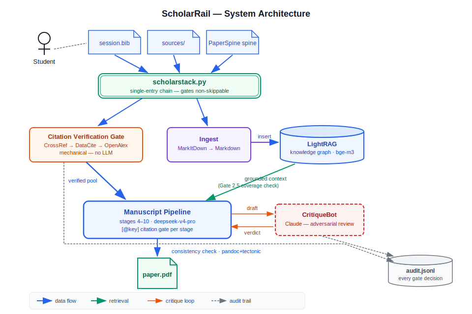

# ScholarStack

An open-source research pipeline that takes a postgraduate student from **raw topic** to **Scopus-ready manuscript** — with mechanically verified citations, non-skippable integrity gates, and a full audit trail. Human decision-making stays at the center; the pipeline accelerates the grunt work.



## Why

AI writing tools invent references. ScholarStack's answer is structural, not hopeful: **writing LLMs only ever see citations that already passed a mechanical verification gate** (CrossRef → DataCite → OpenAlex, no LLM involved), every generated section is checked against that verified pool after generation, and every gate decision lands in an append-only audit log.

## How it works

1. **Verify** — `session.bib` passes the Citation Verification Gate; fakes are rejected with reason codes (`not_found` / `metadata_mismatch`) before any writing happens.
2. **Ingest** — sources convert via MarkItDown into the LightRAG knowledge graph (bge-m3 embeddings, DeepSeek entity extraction).
3. **Gate 2.5** — coverage check: every verified citation must have an ingested source; every ingested source must be verified.
4. **Structure** — [PaperSpine](https://github.com/WUBING2023/PaperSpine) confirms the contribution and section blueprint; drafting cannot start without it.
5. **Draft** — the [manuscript pipeline](https://github.com/lerlerchan/scholarstack-pipeline) writes each section grounded in retrieved graph context (`deepseek-v4-pro`), with a per-stage citation check (bounded re-draft, then hard fail). CritiqueBot (Claude — deliberately a different model family) attacks logic and evidence.
6. **Deliver** — cross-document consistency check, then pandoc + tectonic compile `paper.pdf`. Revisions always create `draft_vN+1`, never overwrite.

One command chains it all: `python scholarstack.py <workdir>`.

## Components

| Component | Role | License |
|---|---|---|
| [scholarstack-pipeline](https://github.com/lerlerchan/scholarstack-pipeline) | Manuscript stages 4–10 | MIT |
| [LightRAG](https://github.com/hkuds/lightrag) | Knowledge-graph retrieval | MIT |
| [PaperSpine](https://github.com/WUBING2023/PaperSpine) | Argument layer / blueprints | MIT |
| [MarkItDown](https://github.com/microsoft/markitdown) | Universal file → Markdown | MIT |
| [claude-scholar](https://github.com/lerlerchan/claude-scholar) | Harness orchestration | MIT |
| Semantic Scholar / Scopus APIs | Literature discovery | free academic tiers |

## API keys

User-supplied keys, one interactive command (input hidden, stored in `~/scholarstack/.env`, mode 600):

```bash
python3 setup_keys.py   # from the scholarstack-pipeline repo
```

| Key | Used for | Get it |
|---|---|---|
| `DEEPSEEK_API_KEY` | Drafting + extraction (~$0.50–1.20/paper) | platform.deepseek.com |
| `SEMANTIC_SCHOLAR_API_KEY` | Literature search | [free form](https://www.semanticscholar.org/product/api#api-key-form) |
| `SCOPUS_API_KEY` | Search + verification (academic use) | [dev.elsevier.com](https://dev.elsevier.com/apikey/manage) |
| `ANTHROPIC_API_KEY` | CritiqueBot adversarial review | console.anthropic.com |

## Repository map

- `docs/scholarstack-prd-v2.0.md` — product requirements (source of truth)
- `docs/HANDOFF.md` — implementation handoff: file map, gotchas, invariants
- `docs/architecture.svg` — system diagram
- `plan/implementation-plan.md` — phase plan + live build status

## Status

Phases 1–5 implemented and tested on the reference deployment (29 tests: 21 unit + 8 integration, all green). Remaining: n8n orchestration wiring, Telegram front door. See `plan/implementation-plan.md`.

## License

AGPL-3.0 (project). Component licenses listed above.
